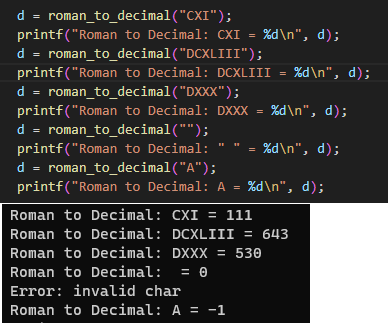

# **SWO3-Übungen - WS2023/24 - Übungszettel 3 - Ausarbeitung**

## **Beispiel 1**

### **Lösungsidee**

Backtracking ist ein Algorithmus, der systematisch verschiedene Möglichkeiten ausprobiert und sich bei Bedarf rückwärts bewegt, um eine bessere Lösung zu finden. Hier beim Sudoku-Rätsel, wird versucht eine Zahl in eine leere Zelle einzusetzen und dann überprüft ob eine Regel verletzt wird und wenn notwendig geht er zurück und probiert eine andere Kombination durch. 

Grundsätzlich würde ich das eindimensionale Array in ein zweidimensionales Array umwandeln, um besser das Sudoku Grid darzustellen.
Dafür könnte man eine Hilfsfunktion programmieren "isSafe" die überprüft ob eine Regel verletzt ist. Die Funktion, die das Sudoku löst, wird zwei For-Schleifen verwenden und rekursiv arbeiten.

### **Testfälle**

Leichtes Sudoku

Schweres Sudoku

Leeres Sudoku

## **Beispiel 2**

roman_to_decimal
In irgendeiner Struktur muss man den Zeichen Werte zuweisen. zB. Entweder über zwei Arrays wo einer die Zeichen speichert und das andere die Werte oder über ein Switch Case statement. Dann muss die man die Unterscheidung machen ob eine kleinere Zahl vor oder nach der größeren steht. Dies könnte man machen, in dem man sich den vorherigen Wert merkt.

decimal_to_roman
Hier würde man sich immer das größte römische Zeichen suchen, dass noch kleiner gleich die Zahl ist, dann dem String hinzufügen und den Wert von der Zahl abziehen. Solange wiederholen in einer Schleife bis die Zahl 0 ist.

### **Lösungsidee**

Verschiedene Testfälle für roman_to_decimal, auch leerer String oder ungültiges Zeichen

Verschiedene Testfälle für decimal_to_roman, auch ungültige Eingaben

### **Testfälle**
